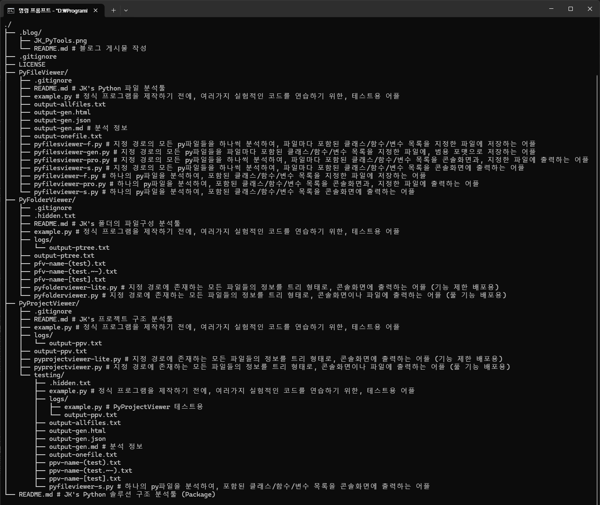

# 블로그 게시물 작성

본 문서는 [개인 블로그 사이트](https://blog.jk-dreams.com/) 게시용 정보를 보관한 것이다.

```bash
$ conda env list
$ conda activate base
$ python -V

$ python PyProjectViewer/pyprojectviewer.py . --hide-size --hide-hidden --pass-ext=py,md
```


## Title
JK_PyTools

## Sub-Title
```
JK's Python Solution Structure Analysis Tools (Package)
JK's Python 솔루션 구조 분석툴 (Package)
```

## Tag
portfolio

## 개발 정보
```
- 개발 이력
  [2026.03.20 ~ 2026.03.21] GitHub 공개
  [2025.10.13 ~ 2025.10.19] 최초 개발
- 개발 언어
  > Python
- 데이터 관리
  > None
- 통신
  > None
```

## 설명
이 것은 Python 솔루션 내에 여러 프로젝트들을 빠르게 분석하는데, 도움을 제공하기 위한 툴들(Apps)로 이루어진, 패키지 입니다.</br>
`솔루션(프로젝트들)`의 파일 구성과 설명을 추출하여 표출하고, py파일마다 코드를 분석하여, 그 정보들(클래스/함수/변수)을 트리 형태의 시각화하여, 운영자에게는 빠른 분석 보고서 작성을, 개발자에게는 구조 분석에 편리함을 제공하기 위함입니다.


## License

### English
```markdown
Software License Agreement (MIT License)

* Copyright Identification
  Copyright (c) 2025 Choi Joonkyu

* Rights & Permissions
  Permission is hereby granted, free of charge, to any person obtaining a copy of this software and associated documentation files (the "Software"), to deal in the Software without restriction, including without limitation the rights to:
    - REPRODUCE: Use, copy, and distribute the software.
    - DEVELOP: Modify, merge, or adapt the source code.
    - COMMERCIALIZE: Publish, sublicense, and/or sell copies of the Software.

* Mandatory Requirements
  The above permissions are subject to the following condition:
    - NOTICE RETENTION: The above copyright notice and this permission notice shall be included in all copies or substantial portions of the Software.

* Legal Disclaimer & Liability
  PLEASE READ CAREFULLY: This section limits the author's legal responsibility.
    - NO WARRANTY:
      THE SOFTWARE IS PROVIDED "AS IS", WITHOUT WARRANTY OF ANY KIND, EXPRESS OR IMPLIED, INCLUDING BUT NOT LIMITED TO THE WARRANTIES OF MERCHANTABILITY, FITNESS FOR A PARTICULAR PURPOSE AND NONINFRINGEMENT.
    - LIMITATION OF LIABILITY:
      IN NO EVENT SHALL THE AUTHORS OR COPYRIGHT HOLDERS BE LIABLE FOR ANY CLAIM, DAMAGES OR OTHER LIABILITY, WHETHER IN AN ACTION OF CONTRACT, TORT OR OTHERWISE, ARISING FROM, OUT OF OR IN CONNECTION WITH THE SOFTWARE OR THE USE OR OTHER DEALINGS IN THE SOFTWARE.
```

### 한글
```markdown
소프트웨어 라이센스 계약 (MIT 라이센스)

* 저작권 식별
  Copyright (c) 2025 최 준규

* 권리 및 권한
  이에 따라 이 소프트웨어 및 관련 문서 파일("소프트웨어")의 사본을 취득한 모든 사람에게, 다음 권리를 포함하되 이에 국한되지 않고, 제한 없이 소프트웨어를 취급할 수 있는 권한이 무료로 부여됩니다.
    - 재생산: 소프트웨어를 사용, 복사 및 배포합니다.
    - 개발: 소스 코드를 수정, 병합 또는 조정합니다.
    - 상업화: 소프트웨어 사본을 게시, 재라이센스 부여 및/또는 판매합니다.

* 필수 요구 사항
  위 권한에는 다음 조건이 적용됩니다.
    - 고지 사항 보유: 위의 저작권 고지 및 본 허가 고지는 소프트웨어의 모든 사본 또는 상당 부분에 포함되어야 합니다.

* 법적 고지 사항 및 책임
  주의 깊게 읽으십시오: 이 섹션은 작성자의 법적 책임을 제한합니다.
    - 보증 없음:
      소프트웨어는 상품성, 특정 목적에의 적합성 및 비침해에 대한 보증을 포함하되, 이에 국한되지 않고 명시적이든 묵시적이든 어떠한 종류의 보증 없이 "있는 그대로" 제공됩니다.
    - 책임의 제한:
      어떠한 경우에도 작성자 또는 저작권 보유자는 소프트웨어나 소프트웨어의 사용 또는 기타 거래로 인해 발생하거나 이와 관련하여 발생하는 계약, 불법 행위 또는 기타 행위로 인한 청구, 손해 또는 기타 책임에 대해 책임을 지지 않습니다.
```
